# Still Water Story Map

Saved from the claude.ai artifact "Still Water Story Map" (design draft 7, built). Lines in quotes are the proposed copy in the prototype. Source: https://claude.ai/artifact/Btj4J9sKkAKqgRqeUmB4zv

## Flow

One run, top to bottom. Blue = play, gold = cutscene, white outlined = the fish's question, red = ending.

```mermaid
flowchart TD
  T[Title] --> OP["OPENING: the boat rows in at dawn. 'Nothing on the lake is moving except you.' his thoughts, tap to read: 'The stranger's bait. Cursed or blessed, he said. It has an eye.' 'Something interesting, for once.' 'Look at that sun.' 'I could stay out here forever.'"]
  OP --> A0["ACT 0, day. 3 catches, cards act 0. 'The water goes very still.'"]
  A0 --> G1["Golden fish surfaces. 'Something interesting, you said. Here I am.' 'Put me back and I'll grant you a wish. Three, if you're patient.' 'First time here, you said. Nobody comes here twice.'"]
  G1 -->|Let it go| K0["kept = no. 'Kind. Nobody kind comes out this far alone.'"]
  G1 -->|Keep it| K1["kept = yes. the fish lies in the boat and dims each act. 'Cold hands. He had cold hands too.' 'Keep me, then. The wish comes anyway.'"]
  K0 --> W1(["'What would you like, fisherman?'"])
  K1 --> W1
  W1 -->|Someone to sit with me| C["'Who?' 'Doesn't matter. Someone.' companion appears on the empty plank, facing the horizon. 'Someone. Nobody asks who.' 'If they ask you anything, don't answer.'"]
  W1 -->|Take me where the fish are| F["OCEAN: mountains sink into haze, the boat shrinks to a speck, huge shadows, then one crosses slowly from the left and settles under you. 'Where the fish are. I'd leave the big one. It's been waiting longer than you have.' then: Tap to cast"]
  W1 -->|A home on the shore| H["cabin light on the far shore, under the sun. 'A home on the shore. One has just come free.' 'Every light out here is for someone. That one is for you.'"]
  W1 -->|Nothing| N1["refused = 1. 'Nobody asks for nothing. I'll ask again.' no cost, 'The lake stays glass.'"]
  F -->|cast while it is under you| ESW[["SWALLOWED. the water opens in a circle"]]
  F -->|wait about 10 s| F2["It slides away. The shore never comes back: the rest of the run is on the open sea. 'Look how they all go the same way.'"]
  C --> COST
  F2 --> COST
  H --> COST
  COST["'A wish costs a little daylight. You said you could stay out here forever.' 'You'll get to.' The sun drops while it speaks"] --> A1
  N1 --> A1
  A1["ACT 1, low sun. 2 catches, cards act 1 with variants. tap the companion: he repeats your opening words"] --> G2
  G2["'The water goes very still again.' 'Back so soon? The lake keeps count.' kept: 'The fish in the boat does not.' 'You cast anyway. Habit.'"] --> W2(["'And this time?'"])
  W2 -->|Make this day last forever| FV["'This one is tired. I know one that never sets.' clouds and birds freeze, the sun stops"]
  W2 -->|Let me hear the fish| HR["'They all say the same thing.' a VOICE appears on the act 2 card"]
  W2 -->|Gold. A boat full of it| GD["GOLD SINK: the boat goes under him; he swims, the lantern floats. 'Sorry. Gold is heavy. You can always come back for it.'"]
  W2 -->|Nothing| N2["refused + 1. second refusal: 'Twice.' 'Nobody asks for nothing twice. What are you?'"]
  FV --> SS
  HR --> SS
  GD --> SS
  N2 --> SS
  SS["SUNSET: 'That was my second, too. This one costs the rest of the day.' 'You'll miss the sun. I'll bring you another.' 'The sun slips into the lake like a coin into a well.' 'You light the lantern.' forever: no stars come up"] --> Q
  Q(["company only, unprompted: 'Will you stay?' the question mark is drawn wrong"]) -->|Yes| QA["answered = yes. your one word joins the charge sheet"]
  Q -->|say nothing| QS["answered = no. in the red he whispers 'Cut the line.'"]
  SS -->|no companion| A2
  QA --> A2
  QS --> A2
  A2["ACT 2, night. 1 catch, card act 2 plus VOICE. once, the lantern gutters and the water is full of eyes. 'The water goes very still. The lantern flame leans toward it.'"] --> RS
  RS["RED SEQUENCE: 'The line goes taut. You did not feel a bite.' the fish waits where the sun set, two seconds of silence. 'One wish left. But first, the sun I promised you.' 'You said forever. I listened.' kept: 'I'm right here, fisherman.'"] --> RED
  RED["THE RED SUN rises on a line, the pupil opens. the companion turns at the pupil beat. 'It is not a sun.'"] --> W3
  W3(["'There it is. Forever, like you said.' 'That bait was never for fish. I should have said.' 'Everything you asked for. Someone to sit with you. A boat full of gold. And forever. Your words, not mine.' companion, if present: 'Don't answer it. Cut the line.' or 'You said you'd stay.' 'I sat where you sit. I said what you said. Three times.' 'I'd like to go home now. What would you like.'"])
  W3 -->|Let me go home| EH[["HOME. the mountains close like jaws"]]
  W3 -->|Take the light away| ED[["DARK. 'As you wish. Without light you won't see the teeth.' the eyelid closes, the lantern dies"]]
  W3 -->|Cut the line| EC[["STILL WATER. 'You reach for the knife on the gunwale.' 'No. Nobody cuts the' dawn, you row away"]]
  W3 -->|Stay with them, if answered| ES[["STAY. the boat drifts to the light, he turns to you, no sunrise"]]
  W3 -->|Let me get my gold, if gold| EDP[["DEEP. the horizon rises past the screen, no bottom, stars below"]]
  W3 -->|Nothing, if refused twice| EN[["SILENT. tail splash, the line goes slack. Counts as Still water"]]
```

## State flags

The game keeps eight small facts. Nothing forks the world; the flags recolour it.

| Flag | Set when | Read by |
|---|---|---|
| kept | You keep the golden fish | Act 1 golden scene (fish speaks from the boat), a card line ("There is a gold scale in its mouth."), the red sequence ("That isn't me pulling."), a caption inside every ending, the ending list |
| wishes[] | Each granted wish, in order | Per-wish world beats, the charge sheet at wish 3, one specific callback for the most recent wish, the ending sentence, the "You asked for:" list |
| firstAsk | Your first answer, including Nothing | The VOICE on the act 2 card if you wished to hear the fish: "I wished for company too. Now I have plenty." |
| refused | Each time you answer Nothing (0 to 2) | The fish's greeting, whether the sun drops, the act 2 card, whether the pupil follows the boat, the fourth button at wish 3 |
| answered | You say Yes to the companion's question | The charge sheet ("'Yes.' Your word."), the companion's whisper in the red, the Stay button at wish 3 |
| heard | Wish 2: hear the fish | Card VOICE, the lake whispering "That sun is bait." at the stalk beat, the chorus at wish 3, the Dark and Still water sentences |
| gold | Wish 2: gold | The gold sink cutscene, boat two pixels lower when the line goes taut, the act 2 card ("Heavy for its size."), the Deep button at wish 3, the gold going over the side in Still water |
| endings (saved) | Every ending reached, across runs | The title counter, the far boat on the title screen, one changed line per later run |

## Choice to consequence

Rule from the research: callbacks, not forks. A choice matters when a later line proves the game saw it.

| Answer | Immediately | Later | At the end |
|---|---|---|---|
| Let it go | "Kind. Nobody kind comes out this far alone." | The fish surfaces again in act 1; in the red it waits where the sun set | Caption in the ending: "Something gold sinks past you. Free." (Home) / it circles the boat all night (Dark) / "Some evenings, the sunset looks back." (Still water) |
| Keep it | The fish is lifted into the boat. "Cold hands. He had cold hands too." | It dims each act and speaks from the boat. "You cast anyway. Habit." In the red: "That isn't me pulling. It never was." Whisper at wish 3: "I'm sorry. I want to go home too." | Home: "Thank you." Dark: "Don't leave me in the boat." Still water: at dawn you lift it over the side. Deep: it goes down with you |
| Someone to sit with me | "Who?" "Doesn't matter. Someone." He sits on the empty plank facing the horizon | Tap him: he repeats your opening words. After the lantern he asks "Will you stay?" Char card: "Its scales show someone sitting behind you." He turns at the pupil beat | Unlocks Stay if you answered. Home: "The seat beside you is empty now. It was your turn." Dark: "Someone breathes behind you all night." Still water: "There is someone in the stern. You do not ask. You row." |
| Take me where the fish are | The ocean cutscene. The big one stops under you; the fish says it would leave it, it has been waiting longer than you have | Cast now: Swallowed. Wait: the shore never returns; the run continues on the open sea with the huge shapes beneath. The fish: "Look how they all go the same way." and the cost lines. Trout card: "Its stomach is full of hooks. It kept biting." At wish 3: "All those fish. Did you see which way they swam?" | Home: "The lake is full. It was always full." Dark: "Something is always biting. You let them." Still water: the shadows follow the line down |
| A home on the shore | A cabin light under the sun. "Every light out here is for someone." | Grayling card: "It smells of woodsmoke. Of the cabin." At wish 3: "That light on the shore. Who did you think lit it?" Stay drifts toward it | Home: "The light on the shore goes out. Nobody was inside." Dark: "The light stays on. Nobody comes down." Still water: the window goes dark at dawn |
| Nothing (wish 1) | "Nobody asks for nothing. I'll ask again." The sun does not drop | Greeting at wish 2: "You again. Still wanting nothing?" VOICE: "I wanted nothing too. It waited." | One sentence if you later asked for something: "You asked once for nothing. It remembered." |
| Make this day last forever | "This one is tired. I know one that never sets." Clouds, birds and the sun stop | Sunset with no stars. At wish 3: "You wanted a sun that never sets. It never will." | Home: "The day does not end. You aren't in it." Dark: "It never begins either." Still water: "Dawn comes anyway. You had forgotten it could." |
| Let me hear the fish | "Listen, then." "They all say the same thing." | VOICE on the act 2 card keyed to your first answer. The lake whispers "That sun is bait." as the line appears. Chorus at wish 3: "cut the line cut the line" | Home: "You know the words already. You will say them." Dark: "The lake keeps talking. You stop answering." Still water: "You can still hear them from the shore." |
| Gold. A boat full of it | The boat goes under him. He swims, the lantern floats beside him. "Sorry. Gold is heavy. You can always come back for it." | Act 2 card: "Heavy for its size." The boat sinks further when the line goes taut. At wish 3: "The gold came up from the bottom. So did I." | Unlocks Deep. Home: "The gold goes down first. It has done this before." Dark: "The boat rides low. You do not bail." Still water: the gold goes over with the line |
| Nothing (wish 2) | First refusal: "Full already? It's a little late for that." Second: "Twice. What are you?" | Two refusals: the act 2 card says "It is looking at you the way you look at it.", the pupil never follows the boat, the red sequence says "You gave me nothing. It wants to see why." | Two refusals unlock the Nothing button at wish 3 and the silent ending |
| Yes (to the companion) | He does not react. The question mark fades | The recount at wish 3 gains "someone who will stay". In the red he says "You said you'd stay." | Unlocks Stay |
| Silence (to the companion) | He looks back at the horizon | In the red, after he turns: "Don't answer it. Cut the line." | No Stay button. His whisper reads as a friend's |

## Endings

Three are always open, three are earned, one is a variant. The counter on the title counts six. Silent folds into Still water so nobody grinds for it.

| Ending | How | What you see | What it says |
|---|---|---|---|
| always: Home | Let me go home | The sky and mountains slide down as a jaw. Fangs along the horizon. Black | You go inside the moment and it closes. Next summer the golden fish speaks in your voice |
| always: Dark | Take the light away | An eyelid closes over the red sun. The lantern gutters and dies. Once, the water is full of eyes | You refuse to look and it passes over you. You never leave. The Viy rule as a life |
| always: Still water | Cut the line | Knife, the stalk falls, the red sun drops into the lake, a real dawn, you row out. The gold goes over, the window goes dark, the stranger stays in the stern | You let go and keep the wound. "Some evenings, the sunset looks back." |
| earned: Stay | Stay with them, after answering the companion | The boat drifts toward the shore light. He turns to face you at last. The sun does not rise. Slow fade | The soft Home. You chose the good day over the morning |
| earned: Deep | Let me get my gold, after wishing for gold | The horizon rises past the top of the screen. The reflection becomes the sky. No bottom, stars below | "The gold is where you left it. So is everything else." |
| earned: Swallowed | Cast while the big one is under the boat, in act 0 | A circle of dark water opens around the boat and takes the water with it | The short run. You asked to be taken where the fish are |
| variant: Silent | Nothing, three times | The line goes slack instead of cut. A tail splash. Dawn | "You wanted nothing. It had nothing to show you." Pushkin's last page |

## What the fish quotes

The fish never lies and never takes. It gives what you literally asked for and reads your words back as consent. Three places carry this:

- After every grant it repeats your option label. "A home on the shore. Done."
- At the red sequence the promise comes true: "But first, the sun I promised you." "You said forever. I listened." The promise was made after wish 2 on every path: "You'll miss the sun. I'll bring you another."
- At wish 3 it recounts what you got, in order, always ending with the sun: "Everything you asked for. Someone to sit with you. A boat full of gold. And forever. Your words, not mine."

Rule: no line says memory, past, stuck, or lure. Bait is said once. The title, the opening, the quoting and the dawn carry it.

## Across runs

- The title screen shows a tiny far boat on the lake after any ending. The next fisherman.
- The companion's first tapped line becomes "First time here. You said that last time." His other lines are your own, bent a little: "Look at that sun. Still there." "We could stay out here forever."
- The fish's first line becomes "You again. Or someone wearing you." After Home: "Back out already? It doesn't usually let go."
- The first act 0 card of a later run: "There is an old hook in its lip."
- Nothing is locked behind replay. These are four lines.

Runtime: a full run stays between 4.5 and 6.5 minutes. The earned endings replace the last minute rather than adding to it. Swallowed is deliberately a ninety-second run.
